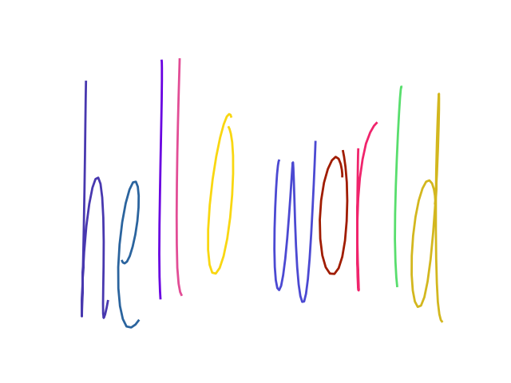
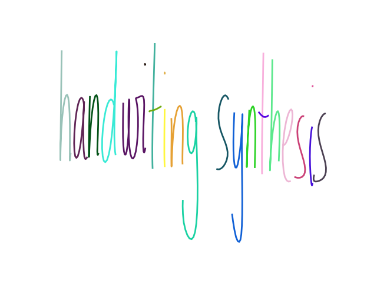

# Soft Window with Transformers for Handwriting Synthesis

You can find a detailed write-up about this project [here](https://blog.anomam.com/posts/2025-06-18-soft-window-transformers-hw-synthesis).

## Dependencies

Make sure to [install](https://docs.astral.sh/uv/getting-started/installation/) the package manager [uv](https://docs.astral.sh/uv/), and it will take care of installing all 
the necessary python dependencies the first time you run the script.


## Usage

You can then create some handwriting, for instance for the text "hello world!", using:

```bash
uv run write.py "hello world" --seed 23 --bias 20
```

This should give you the following:



As a rule of thumb, you can play with the `seed` parameter if some letters are missing/wrong, and with the `bias`
parameter to improve the legibility.

Sometimes, it helps to put the letters multiple times so that the soft window attention doesn't skip it by accident.
That's one of the points to be improved with the model. For instance:

```bash
uv run write.py "handwriting syntthesiss" --seed 213 --bias 10
```



All additional options will be printed when running:

```bash
uv run write.py --help
# or
uv run write.py handwrite --help
```

## Resources

I got a lot of help for data processing and model setup from the following resources:

- [sjvasquez/handwriting-synthesis](https://github.com/sjvasquez/handwriting-synthesis)
- [hardmaru/write-rnn-tensorflow](https://github.com/hardmaru/write-rnn-tensorflow)
- [nnsvs/nnsvs](https://github.com/nnsvs/nnsvs)
- [karpathy/nanoGPT](https://github.com/karpathy/nanoGPT)
- [karpathy/makemore](https://github.com/karpathy/makemore)


## Citing

If you find this work useful, please cite it as:

```
@article{anomam2025softwindowtransformers,
  title   = "Soft window attention with transformers for handwriting synthesis",
  author  = "Abou Anoma, Marc",
  journal = "blog.anomam.com",
  year    = "2025",
  url     = "https://blog.anomam.com/posts/2025-06-18-soft-window-transformers-hw-synthesis"
}
```
